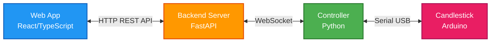

# An RGB Candlestick for Christmas
This is the code and a short how-to on how I made my RGB LED candlestick for christmas.

[](http://www.youtube.com/watch?feature=player_embedded&v=RDOWLQ8P0aQ)

### Features:
* Can be controlled by any computer with Python support and a USB port.
* Single cable for both power and programming.
* Simple interface between the candlestick and controller.
* Easy to add new features and light-patterns.

### Design
The project consists of three main components: the candlestick hardware, the controller software, and the backend server.

#### Architecture Overview



The system uses a WebSocket-based architecture where:
- **Backend Server**: Central FastAPI server that manages all candlestick connections and provides a REST API
- **Controller**: Python application that connects to the backend via WebSocket and controls the physical candlestick
- **Web App**: React frontend that communicates with the backend to control candlesticks

This architecture supports multiple candlesticks connecting to a single backend, enabling centralized management and control.

#### Candlestick
The candlestick is designed to be easy and inexpensive to build, simple to use, and very reliable. It is:
* Powered and controlled through a USB interface.
* Uses a serial over USB interface to the controller.
* Accepts a byte-array with values for each LED from the controller.

The version 2 of the candlestick uses a single Arduino Nano, but any Arduino, ESP32 or similar would work as long as it has a USB port and fits within the candlestick.
The leds are 5mm WS2812 (NeoPixel compatible) RGB Leds.

[Build instructions](/candlestick)

#### Controller
The controller software is written in Python and connects to the backend server via WebSocket. It runs on any system with Python support (x86, ARM, Raspberry Pi) and communicates with the Arduino via USB serial.

For more information, see the [controller README](/controller/)

#### Backend
The backend server is a FastAPI application that manages WebSocket connections from controllers and provides a REST API for web applications. It tracks the state of all connected candlesticks and routes commands appropriately.

For more information, see the [backend README](/backend/)

#### Web App
A React/TypeScript web interface for controlling candlesticks through the backend API. Supports multiple candlesticks and displays real-time connection status.

For more information, see the [webapp README](/webapp/)

## Quick Start

See the [QUICKSTART.md](./QUICKSTART.md) guide for step-by-step instructions on getting the system running.

## Quick and Dirty Installation Using Ansible

There is an Ansible [playbook](./ansible_playbook.yaml) available that can be used to install both the web app, controller, Nginx configuration and systemd-unit on a Rasperry Pi.

```sh
ansible-playbook -i "{hostname}," -u {username} --become ansible_playbook.yaml
```

Runs as root, uses system packages etc... Not pretty, but it works!

## Todo / Improvement ideas

Everything is terribly hacky. Remember that this is a weekend project setup a some week before Christmas, eventually with small improvements "next year".

* Make the number of candlestick LEDs dynamic (support for 7 LED candlesticks).
* Implement basic light patterns in the Arduino code so that it can run without a dedicated controller.
* Implement a GET function in the API so that the web app can retrieve the current state of the candlestick.
