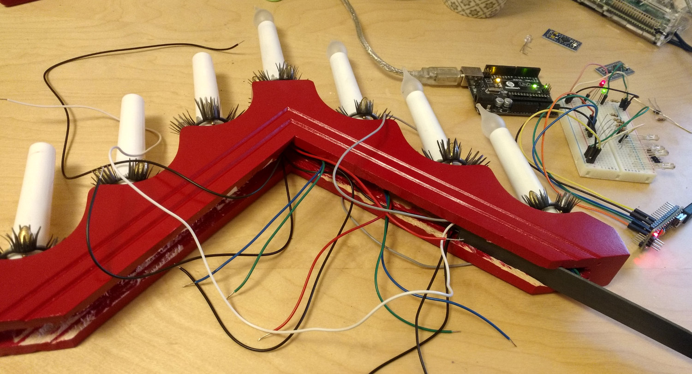

# Building your candlestick

## Parts needed

* A candlestick
* 7 LED spare bulbs (if the candlestick has traditional bulbs)
* 7 APA106 RGB LED diodes
* Some wires
* 1 Arduino Nano/Mini
* 1 USB-cable (To the Arduino)

You will also need a soldering iron, and some basic soldering skills.

## RGB bulbs

Start with buing a set of LED spare bulbs for your candlestick, usually found at your grocery store, or where you found the candlestick.
It's important that it's LED bulbs, since regural bulbs is built as sealed glass bulbs containing a vacum that will implode if you're not very careful disassembling them.

Using a hacksaw, cut the bulb at the red line:  

And remove the old boring LED:  

Insert the RGB leds, glue in place, and solder on some extension wires. Pictures will be added in the future.

## Rebuild the candlestick
More Pictures will be added at a later time.

After inserting your custom made bulbs, the candlestick should look something like this:  

Solder everything together, and verify that it works before assembling the candlestick again.
