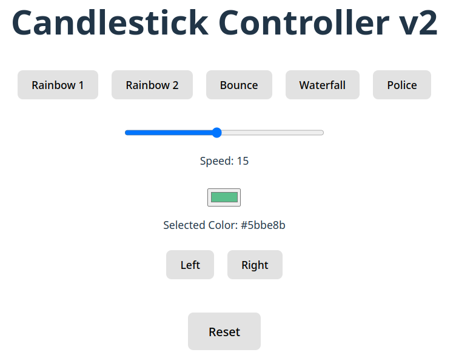

# Candlestick Web App

This is the web app for the RGB Candlestick. It's a React application written in TypeScript, created with Vite and Node.js.

The webapp connects to the backend server to control one or more candlesticks via a REST API.

## Preview



## Architecture

The webapp connects to the backend server via REST API:

```
Web App (React) → Backend API (FastAPI) → Controller (WebSocket) → Candlestick
```

Key features:
- Real-time connection status display
- Support for multiple candlesticks
- Automatic status refresh every 3 seconds
- Color picker, speed control, and pattern selection

## Requirements

- Node.JS (v18 or higher recommended)
- A running backend server (see `/backend` directory)

## Development environment

First you must have a working installation of Node.JS. Install it in your preferred way:
[https://nodejs.org/](https://nodejs.org/)

### Install dependencies

With Node.JS installed, the build dependencies can be installed by:
```bash
cd rgb_app
npm install
```

### Configuration

The webapp can be configured using environment variables:

1. Copy the example environment file:
```bash
cp .env.example .env.local
```

2. Edit `.env.local` to set your backend URL:
```bash
# Backend API URL
VITE_BACKEND_URL=http://localhost:8000

# Default candlestick ID
VITE_CANDLESTICK_ID=candlestick_001
```

**Note**: If you don't create a `.env.local` file, the defaults will be used (`http://localhost:8000`).

### Run dev server

**Important**: Make sure the backend server is running first!

```bash
# In another terminal, start the backend
cd ../../backend
python3 main.py
```

Now start the development server:

```bash
npm run dev
```

This gives a local web server at `http://localhost:5173` where changes can be viewed live.

The webapp will:
- Connect to the backend at `http://localhost:8000`
- Display connection status at the top of the page
- Show all available candlesticks
- Allow switching between multiple candlesticks

### Compile

To compile the code and create a production site, run:
```bash
npm run build
```
This will generate an `index.html` + the javascript files in `./dist`. These files could then be served by any web server.

## Features

### Connection Status Display
The webapp displays a status badge in the top right corner showing:
- **Connection status**: Green when connected, red when disconnected
- **Candlestick name**: Shows which candlestick is connected
- **Last update time**: When the status was last refreshed
- **Auto-refresh**: Updates every 3 seconds

### Control Features
- **Pattern selection**: Rainbow, bounce, falling, police, wave
- **Speed control**: Adjust animation speed with a slider
- **Color picker**: Set custom static colors
- **Direction control**: Up, down, left, right for supported patterns

### Multi-Candlestick Support
- Automatically detects all candlesticks connected to the backend
- Switch between multiple candlesticks (when available)

## Deployment

### Production Build

1. Build the production bundle:
```bash
npm run build
```

2. The output will be in the `dist/` directory and can be served by any web server.

### Using nginx

Example nginx configuration:

```nginx
server {
    listen 80;
    server_name candlestick.example.com;
    
    root /var/www/html/candlestick;
    index index.html;
    
    # Serve the React app
    location / {
        try_files $uri $uri/ /index.html;
    }
    
    # Proxy API requests to backend
    location /api {
        proxy_pass http://localhost:8000;
        proxy_http_version 1.1;
        proxy_set_header Upgrade $http_upgrade;
        proxy_set_header Connection 'upgrade';
        proxy_set_header Host $host;
        proxy_cache_bypass $http_upgrade;
    }
}
```

See [nginx_site.conf](./nginx_site.conf) for a complete example.

### Environment Variables

For production builds with custom backend URLs:

```bash
# Build with custom backend URL
VITE_BACKEND_URL=http://backend.example.com:8000 npm run build
```

Or create a `.env.production` file:
```bash
VITE_BACKEND_URL=http://backend.example.com:8000
VITE_CANDLESTICK_ID=candlestick_001
```

## Troubleshooting

### "Failed to connect to backend"
- Make sure the backend server is running: `curl http://localhost:8000`
- Check the backend URL in your `.env.local` file
- Look at browser console for detailed error messages

### "No candlesticks found"
- Make sure a controller is connected to the backend
- Check backend logs: `journalctl -u rgb-candlestick-backend -f`
- Verify controller is running: `journalctl -u rgb-candlestick-websocket -f`

### "Candlestick not connected"
- The candlestick was recently connected but is now offline
- Check controller logs for connection issues
- Controller may need to be restarted

### Port Already in Use
If the dev server won't start because port 5173 is in use:
```bash
# Find and kill the process using port 5173
lsof -ti:5173 | xargs kill -9
```

### Cleanup / troubleshooting

If moving the development environment between computers, or if the node modules get messed up:
```bash
rm -rf node_modules package-lock.json
npm install
```

## API Endpoints

The webapp uses the following backend API endpoints:

- `GET /api/candlesticks` - List all connected candlesticks
- `GET /api/candlesticks/{id}` - Get specific candlestick status
- `POST /api/candlesticks/{id}/command` - Send command to candlestick

Example command payload:
```json
{
  "program": "rb",
  "speed": 15,
  "direction": "left",
  "color": "#ff0000"
}
```

